# Model One: Iris flowers types Classification

As humans we can easily classify objects just by looking at them, smelling them or touching them. using our senses is essential to do so , but what about machines, can they learn from data so they can classify by their own without using any human sensing?

in this Model i made a machine learning program that you feed it with data about the Flower's:
> petals length & width.

> Sepals length & width.

so it classify it and tell you if it was:
- Iris Versicolor
- Iris Setosa
- Iris Virginca

## Process & Coding Steps :

## 1- Collecting th needed data 
i needed to feed my model with data so it can process it and learn from it.
you can find the flower's data included in here [repo](https://github.com/AnanSoli/)

## 2- preparing the data
 - i needed to use the following python libraries in this model

> pandas, matplotlib, seaborn, scikit-learn

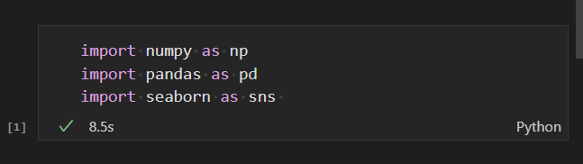

 - add the following code to open, read the comma separated data and save it into a dataframe

## 3- Add column headers to the dataframe
 - adding headers to facilitate dataframe reading.

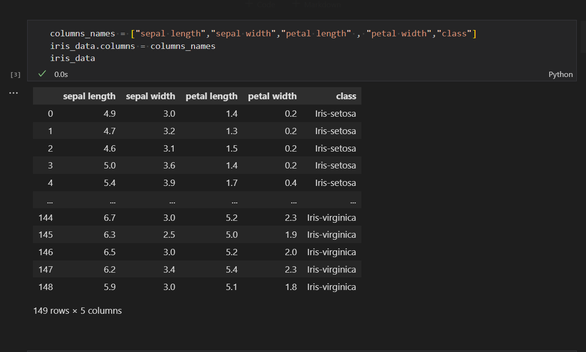

## 4- check null data exists
- we need to check if there are any null, empty or any missing data.

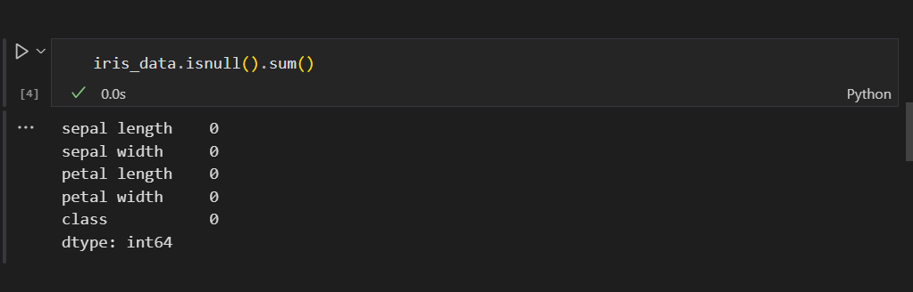

## 5- Getting a count of how much data i have
- it's important for you to know how much of data you are using to train and feed to your model so you can know later how to improve results accuracy.

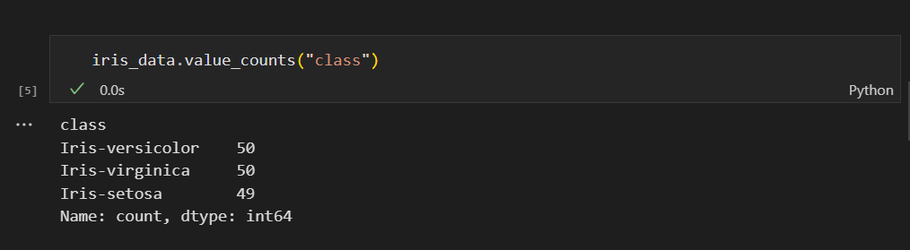

## 6- data visualization
- reading raw data can be sometimes challenging , so visualizing this data will be much easier to read.

    using counting plot to show the flowers classes data count.
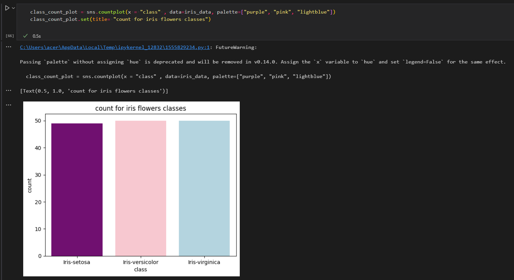

    using scatter plot to show a comparison between the petal width and length for each flower class

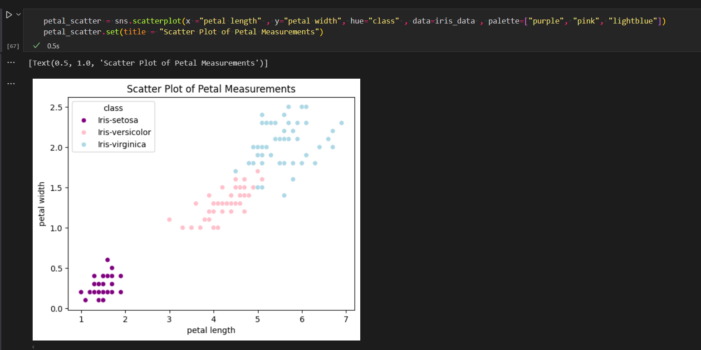

    using also scatter plot to show a comparison between the sepal width and length for each flower class
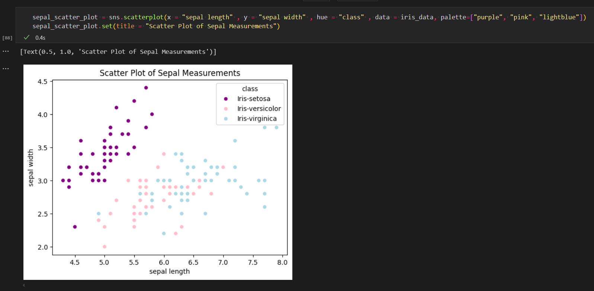

## 7- Categorizing the data to prepare it for training .
- our dataframe consist of 3 Labels/classes of Iris flowers 
    > Iris Versicolor, Iris Setosa, Iris Virginca  (classes/Labels)

- also four features for each class 
    > Petal length , Petal width

    >Sepal Length, Sepal width

features

label

## 8- dividing the data we have into traning data and testing data
- we need to divide the data we have into two parts 
    > data used for training the model to classify

    > data used to test the model if the classification is good

     the training data will be 80% of the whole data, and the testing data will be 20% of the whole data.

## 9- Choosing the model or the Algorithm to perform the classification with.

- i choose the K-Nearest Neighbor (KNN) algorithm because it classifies the object based on its nearest and closest neighbour.

- the algorithm will choose within the closest 5 neighbors without counting the distance.

- i fed the model with the needed training data i made to train the model and print out the accuracy produced to classify objects. the accuracy produced (96.6%)
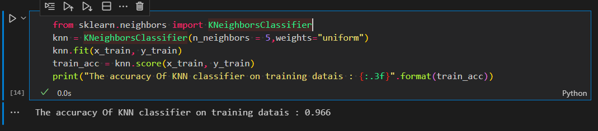

- using it now on th testing data.
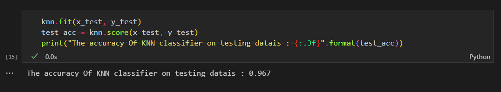

## 10- To find out why the accuracy is only 96%, i used the Confusion matrix

- i used this method to compare between the actual classes for the tested objects compared with their test results from the (KNN)

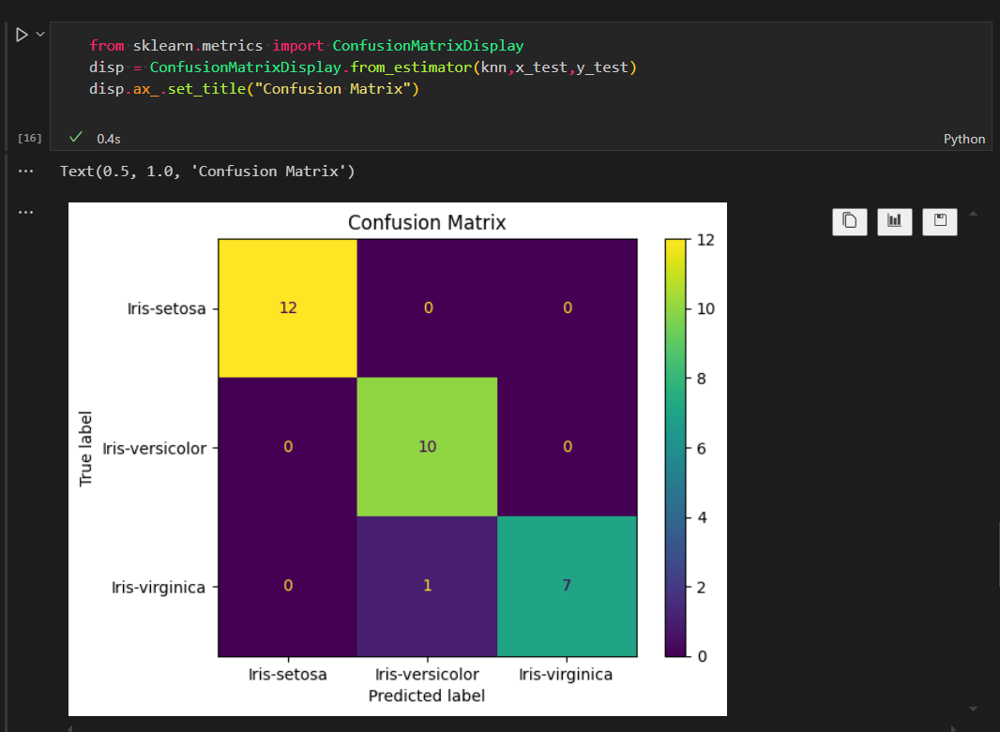

## 11- doing some parameters tuning 

- i wanted to do parameter tuning for the KNeighborsClassifier(n_neighbors = 5,weights="uniform") in step no.9 to produce the best accuracy to classify the objects.
- so i needed to use the follwoing libraries and methods to produce the best values for the parameters which they are :
    ('n_neighbors': 6, 'weights': 'distance)

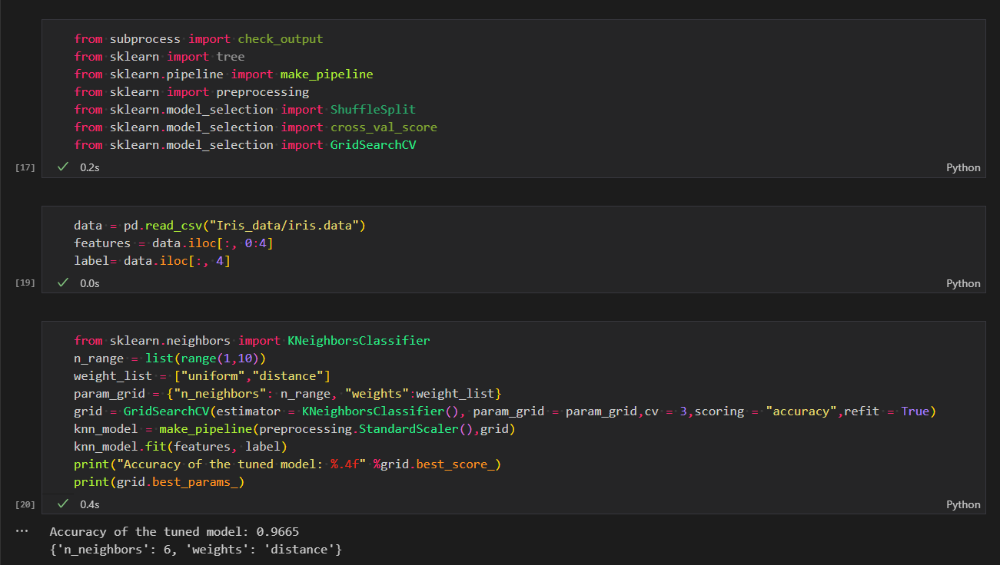

## 12- now i need to save this machine learning model in a pickle file to be used to classify the Iris flowers.

 - after i know the best params that produces the best accuracy i should modify the model accordignly before saving it.

## 13 - finally, it's time to try the model out.

- i feed it with values for petals length & width. , Sepals length & width. for an unknown object and see what type the model will classify it into.

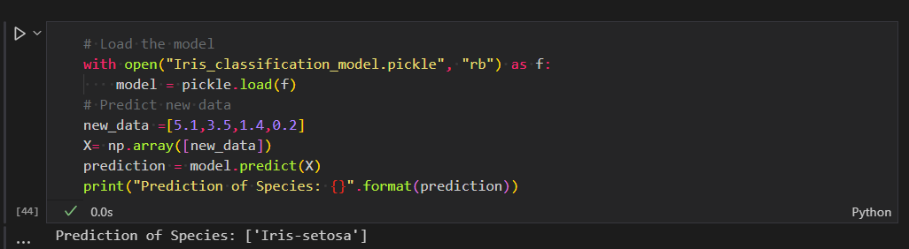

