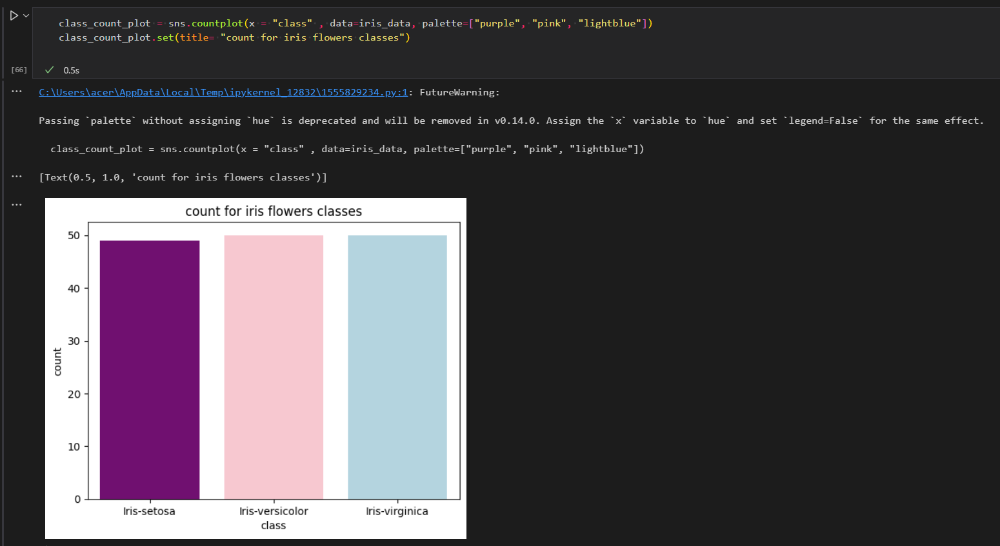

# Model One: Iris flowers types Classification

As humans we can easily classify objects just by looking at them, smelling them or touching them. using our senses i essential to do so , but what about machines, can they learn from data so they can classify by their own ?

in this Model i made a machine learning program that you feed it with data about the Flower's:
> petals length & width.

> Sepals length & width.

so it classify it and tell you if it was:
- Iris Versicolor
- Iris Setosa
- Iris Virginca

## Process & Coding Steps :

## 1- Collecting th needed data 
i needed to feed my model with data so it can process it and learn from it.
you can find the flower's data included in the [repo](https://github.com/AnanSoli/)

## 2- preparing the data
 - you will need the following python libraries in this model

> pandas, matplotlib, seaborn, scikit-learn

 - add the following code to open, read the comma separated data and save it into a dataframe

    

## 3- Add column headers to the dataframe
 - adding headers to facilitate dataframe reading.
    

## 4- check null data exists
    - you need to check if there are any null, empty or any missing data.

## 5- Getting a count of how much data you have
    - it's important for you to know how much of data you are using to train and feed to your model so you can know later how to improve results accuracy.

## 6- data visualization
    - reading raw data can be sometimes challenging , so visualizing this data will be much easier to read.

